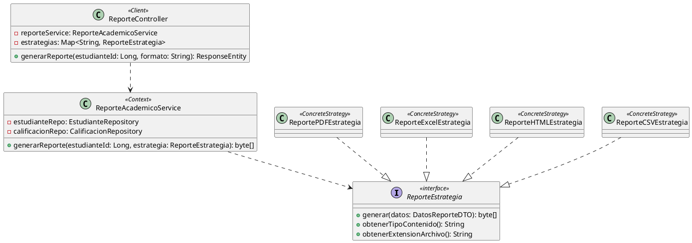

# 🏛️ Aplicación de Patrones de Diseño GRASP y GoF en un Sistema de Información Académico

> **Maestría en Arquitectura de Software** · Temas Avanzados de Diseño de Software  
> Politécnico Grancolombiano · Bogotá D.C., 2026

---

## 📌 Descripción del Proyecto

Este repositorio contiene el análisis, diseño y propuesta de refactorización arquitectónica de un módulo crítico dentro de un **Sistema de Información Académico (SIA)**: el módulo de generación de reportes académicos.

El proyecto demuestra cómo un diseño monolítico y altamente acoplado puede transformarse en una arquitectura modular, flexible y sostenible mediante la aplicación rigurosa de **patrones de diseño GRASP** (General Responsibility Assignment Software Patterns) y **patrones GoF** (Gang of Four), específicamente el patrón **Strategy**.

---

## 🎯 Problema Identificado

El módulo de reportes del SIA presentaba una clase `ReporteAcademicoService` con más de **2.800 líneas de código**, concentrando responsabilidades heterogéneas:

- Acceso a datos (repositorios)
- Lógica de negocio (cálculo de promedios, estados académicos)
- Generación de documentos PDF, Excel, HTML, CSV, Word
- Envío de reportes por correo electrónico

**Resultado:** una *God Class* frágil, con acoplamiento alto, cohesión baja, cobertura de pruebas inferior al 15% y tiempos de desarrollo de hasta 3 semanas para agregar un nuevo formato.

---

## 🧠 Patrones Aplicados

### GRASP

| Patrón | Aplicación en el SIA |
|--------|----------------------|
| **Alta Cohesión** | Cada clase tiene una única responsabilidad bien definida |
| **Bajo Acoplamiento** | Dependencias gestionadas mediante interfaces, no implementaciones concretas |
| **Information Expert** | `Estudiante.calcularPromedio()` vive en la entidad que posee las calificaciones |

### GoF — Patrón Strategy (Comportamiento)

```
Strategy Interface:     ReporteEstrategia
Concrete Strategies:    ReportePDFEstrategia
                        ReporteExcelEstrategia
                        ReporteHTMLEstrategia
                        ReporteCSVEstrategia
Context:                ReporteAcademicoService (refactorizado)
Client:                 ReporteController
```

---

## 🏗️ Arquitectura de la Solución

```
┌─────────────────────────────────────────────────────────────┐
│                     ReporteController                       │
│                    <<Client / REST API>>                    │
│   GET /api/reportes/{estudianteId}?formato=pdf|excel|html   │
└──────────────────────────┬──────────────────────────────────┘
                           │ selecciona estrategia + delega
                           ▼
┌─────────────────────────────────────────────────────────────┐
│               ReporteAcademicoService                       │
│                     <<Context>>                             │
│  1. Obtiene datos del dominio (repositorios)                │
│  2. Construye DatosReporteDTO                               │
│  3. Delega a ReporteEstrategia                              │
└──────────────────────────┬──────────────────────────────────┘
                           │ usa interfaz (polimorfismo)
                           ▼
            ┌──────────────────────────┐
            │    <<interface>>         │
            │   ReporteEstrategia      │
            │  + generar(DTO): byte[]  │
            │  + getTipoContenido()    │
            │  + getExtension()        │
            └──────┬───────────────────┘
                   │ implements
     ┌─────────────┼─────────────┬──────────────┐
     ▼             ▼             ▼              ▼
  PDF          Excel          HTML            CSV
 (iText 7)  (Apache POI)  (Thymeleaf)     (OpenCSV)
```

---

## 📊 Impacto Cuantificable

| Métrica | Antes | Después |
|---------|-------|---------|
| Líneas por clase | **> 2.800** | **≤ 200** |
| Tiempo para nuevo formato | **~3 semanas** | **~2 días** |
| Cobertura de pruebas | **< 15%** | **> 85%** |
| Fan-Out (dependencias salientes) | **12** | **3** |
| Inestabilidad del módulo (I) | **0.89** | **0.31** |
| Clases afectadas al cambiar PDF | **1 clase central** | **0 clases adicionales** |
| Onboarding al módulo | **~1 semana** | **~2 horas** |

---

## 📐 Diagrama UML

El diagrama de clases completo fue modelado en **PlantUML** e integrado con **Visual Studio Code**, representando todas las relaciones entre `ReporteController`, `ReporteAcademicoService`, la interfaz `ReporteEstrategia`, las estrategias concretas, el DTO y la entidad de dominio `Estudiante`.



---

## 🔑 Principios SOLID Aplicados

| Principio | Evidencia en el diseño |
|-----------|------------------------|
| **SRP** — Responsabilidad Única | Cada clase tiene exactamente una razón para cambiar |
| **OCP** — Abierto/Cerrado | Nuevos formatos = nueva clase; sin tocar código existente |
| **LSP** — Sustitución de Liskov | Cualquier `ConcreteStrategy` es sustituible por otra |
| **DIP** — Inversión de Dependencias | El contexto depende de la abstracción, no de implementaciones |

---

## 💡 Beneficios Adicionales de la Arquitectura

- **⚡ Procesamiento concurrente:** Estrategias independientes y sin estado compartido, aptas para ejecución paralela.
- **🔧 IoC + Spring Boot:** Cada estrategia es un `@Component` inyectable; mapa de estrategias gestionado por el contenedor.
- **🎨 Patrón Decorator integrable:** Firma digital, marcas de agua o cifrado como decoradores sin modificar la lógica base.
- **🧪 Pruebas A/B nativas:** Diferentes versiones de una estrategia pueden coexistir y activarse por configuración.
- **📋 Auditoría y trazabilidad:** Encapsulación facilita logging de tipo de reporte, usuario, timestamp y estrategia utilizada.

---

## 🛠️ Stack Tecnológico (Propuesta)

| Componente | Tecnología |
|-----------|------------|
| Backend | Java 21 + Spring Boot 3.x |
| Patrón arquitectónico | Strategy (GoF) + GRASP |
| Generación PDF | iText 7 |
| Generación Excel | Apache POI |
| Generación HTML | Thymeleaf |
| Generación CSV | OpenCSV |
| Modelado UML | PlantUML + VS Code |
| Build | Maven |

---

## 📁 Estructura del Repositorio

```
📦 Laboratorio-No-3/
├── 📄 README.md
├── 📄 Desarrollo_Proyecto_Alejandro_De_Mendoza.pdf
├── 📂 src/
│   └── 📂 main/java/com/sia/reportes/
│       ├── 📄 ReporteEstrategia.java           ← Strategy interface
│       ├── 📄 ReportePDFEstrategia.java         ← ConcreteStrategy A
│       ├── 📄 ReporteExcelEstrategia.java       ← ConcreteStrategy B
│       ├── 📄 ReporteHTMLEstrategia.java        ← ConcreteStrategy C
│       ├── 📄 ReporteCSVEstrategia.java         ← ConcreteStrategy D
│       ├── 📄 ReporteAcademicoService.java      ← Context
│       ├── 📄 ReporteController.java            ← Client (REST)
│       ├── 📄 DatosReporteDTO.java              ← DTO
│       └── 📄 Estudiante.java                  ← Domain (Information Expert)
└── 📂 uml/
    └── 📄 PatronStrategy_SIA.puml              ← Diagrama PlantUML
```

---

## 📚 Bibliografía de Referencia

- Gamma, E., Helm, R., Johnson, R., & Vlissides, J. (1994). *Design Patterns: Elements of Reusable Object-Oriented Software.* Addison-Wesley.
- Larman, C. (2004). *Applying UML and Patterns* (3rd ed.). Prentice Hall.
- Martin, R. C. (2003). *Agile Software Development: Principles, Patterns, and Practices.* Prentice Hall.
- Freeman, E., & Robson, E. (2004). *Head First Design Patterns.* O'Reilly Media.
- Fowler, M. (2002). *Patterns of Enterprise Application Architecture.* Addison-Wesley.

---

## 👨‍💻 Autor

**Alejandro De Mendoza**  
Maestría en Arquitectura de Software  
Politécnico Grancolombiano · 2026

> *Presentado a:* **Ing. Lina María Montoya Suárez**  
> Materia: Temas Avanzados de Diseño de Software

---

<div align="center">

*"Any fool can write code that a computer can understand.*  
*Good programmers write code that humans can understand."*  
— **Martin Fowler**

</div>
